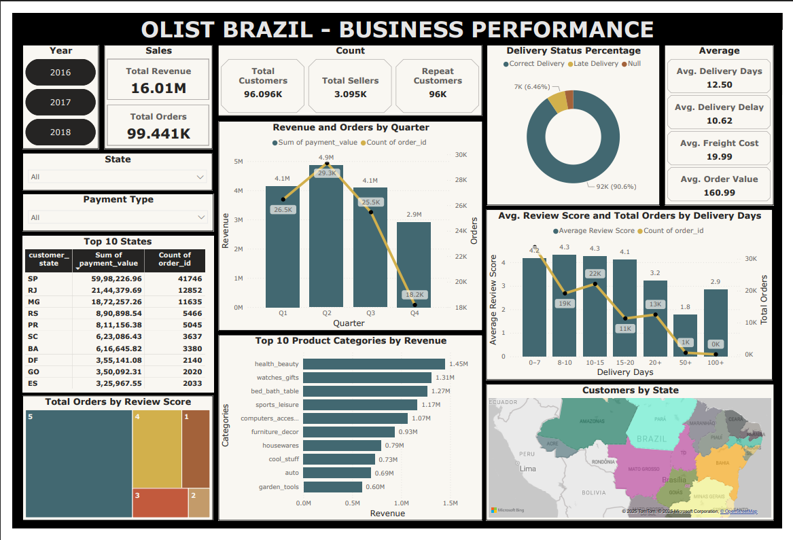

# Data Analysis

### Power BI Analysis
---------------------------------------------------------------------------------------------------------------------

**Link:**
**Power BI Dashboard: *[Olist_Business_Performance_Dashboard](https://drive.google.com/drive/folders/1FZOpgvmjpT_275h3RbOeugZj5rIXuOU0?usp=sharing)***
**Methods Used:**
* Removed unnecessary columns
* Created calculated columns and DAX measures
* Used slicers and interactive visuals
* Built both desktop and mobile dashboards
